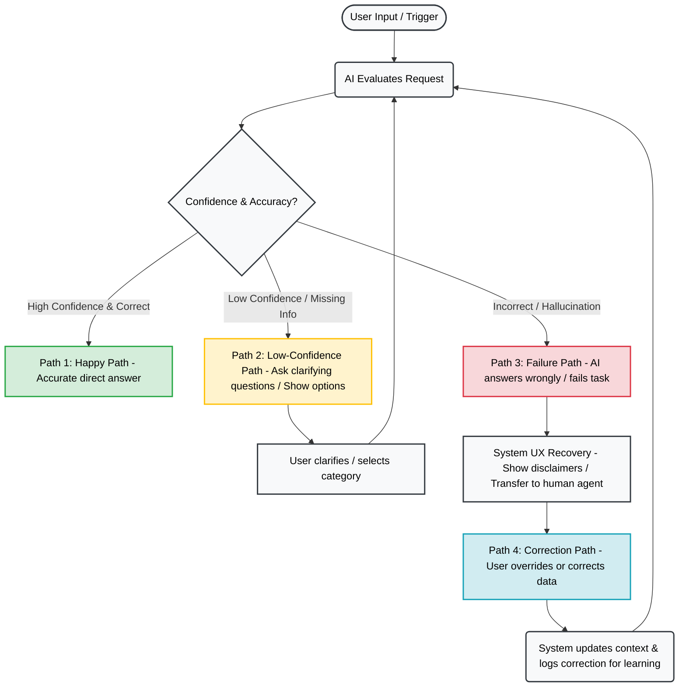
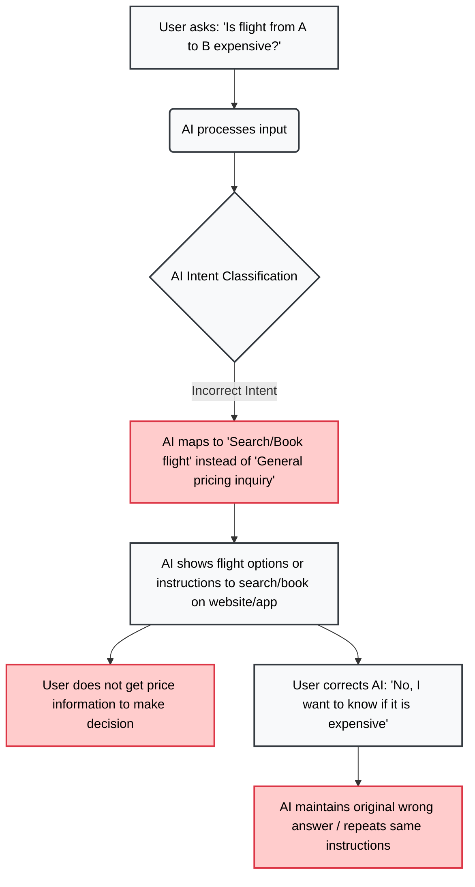
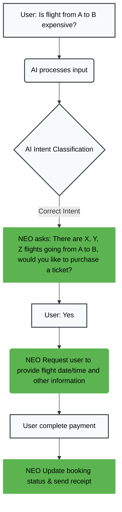

## 1. Sản phẩm dùng: Vietnam Airlines's NEO
## 2. Promise vs Reality
- Product hứa sẽ hổ trợ về việc hành lý, thay đổi vé/hoàn tiền và thủ tục cho người dùng
- Mình kỳ vọng AI có thể xử lý việc đặt vé
- Khi dùng, AI không xử lý việc đặt vé mà chuyển hướng cho nhân viên
- AI trả lời không đúng về việc hỏi giá
- Khi user sửa lại câu trả lời thì AI vẫn giữ nguyên câu trả lời ban đầu.

<div style="display: flex; gap: 10px; flex-wrap: wrap;">
  
  
  
  
</div>

## 3. 4 Paths


### 4. Finding
```text
Khi user hỏi "Is flight from A to B expensive?",
AI hiểu như user muốn tìm vé máy bay đi từ A đến B thay vì tìm giá vé,
hậu quả là user không biết giá vé để đưa ra quyết định.
Lỗi thuộc Intent.
Nên sửa bằng Failure path: chuyển đến nhân viên tư vấn.
```

### As-is Flow (Current Broken Experience - VNA NEO Chatbot)




### To-be Flow (Proposed Solution - In-chat Booking & UX Recovery)





